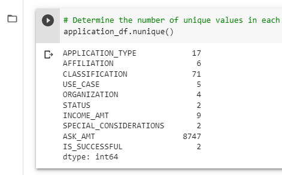
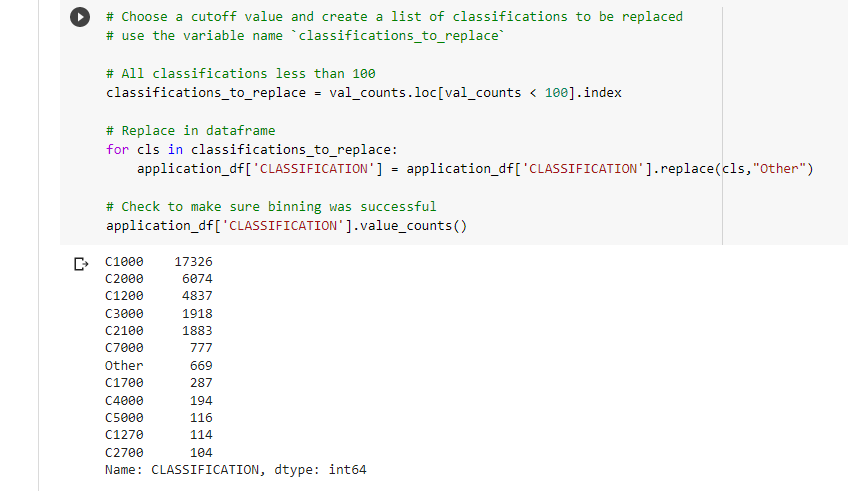
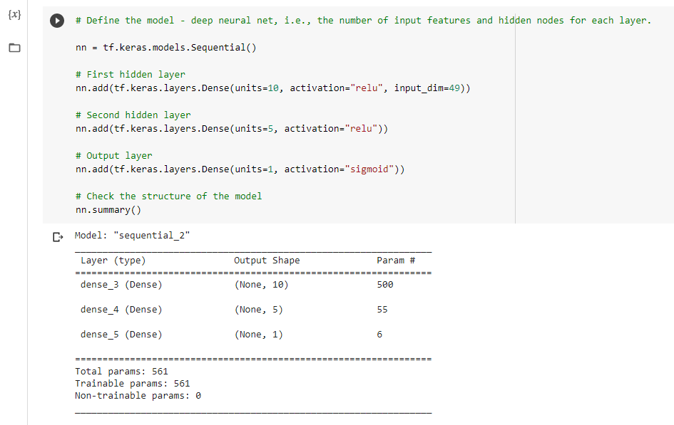
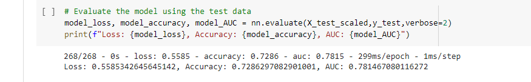

# Overview

This analysis was designed to investigate whether a neural network model could be successfully used to predict whether applicants for funding would be able to successfully use the provided funding. A dataset was provided containing a list of previous applicants with various data, including whether their funding was successful.

Details of the analysis is given below.

# Pre-processing

Before use in the analysis, the data was cleaned and processed

## Columns

The data was provided with the following columns, with the column use indicated

* **EIN** and **NAME**—Identification columns : ***Unnecessary data***
* **APPLICATION_TYPE**—Alphabet Soup application type : ***Feature***
* **AFFILIATION**—Affiliated sector of industry : ***Feature***
* **CLASSIFICATION**—Government organization classification : ***Feature***
* **USE_CASE**—Use case for funding : ***Feature***
* **ORGANIZATION**—Organization type : ***Feature***
* **STATUS**—Active status : ***Feature***
* **INCOME_AMT**—Income classification : ***Feature***
* **SPECIAL_CONSIDERATIONS**—Special consideration for application : ***Feature***
* **ASK_AMT**—Funding amount requested : ***Feature***
* **IS_SUCCESSFUL**—Was the money used effectively : ***Target***

## Data cleaning steps

The following steps were undertaken in cleaning the data

1. Remove unnecessary columns EIN and NAME
2. Review the number of unique entries in all columns to identify which ones could be reduced in number
   - Columns with large numbers of unique entries were `APPLICATION_TYPE`, `CLASSIFICATION` and `ASK_AMT`. `ASK_AMT` is the asked amount and so not suitable for reducing the number of categories  
3. Bin all categories in `APPLICATION_TYPE` with fewer than 500 applications into an `Other` category  
4. Bin all categories in `CLASSIFICATION` with fewer than 100 applications into and `Other` category  
5. Convert categorical data to numeric with `pd.get_dummies`
6. Split data into feature and target arrays
7. Split data into train and test datasets
8. Scale both datasets using `StandardScaler`

# Compiling, training and evaluating the model

## Initial model

An initial model was set up consisting of two hidden layers with the `relu` activation, and an output layer with a `sigmoid` activation. The two hidden layers had 10 and 5 neurons respectively. This model was compiled with `binary_crossentropy` loss and the `adam` optimiser, and recording the `accuracy` and `AUC` metrics. The model was trained on the training dataset and evaluated on the test dataset.

Evaluating the model showed it had an accuracy of 0.728 and an AUC of 0.781. This is a reasonable score, but below our target accuracy of 0.75. Therefore, steps were taken to try to improve the model performance.

## Optimisation 1: increase neurons

The model's complexity was increased by adding additional neurons to the model. This increased the accuracy to 0.736, which is still below our target performance.

## Optimisation 2: autotuning

Autotuning was set up using `keras-tuner`. The tuner was given the following parameters:
- Activation: `relu`, `tanh`, `sigmoid`
- Number of units: 1 to 10
- Number of layers: 1 to 6

The output layer and model compilation was as for the initial model.

The best accuracy found was 0.730. This is slightly lower than the score in Optimisation 1, possibly because the number of neurons was limited to 10 in each layer. However, it is noted that all the scores are similar, so there is likely to be little gain in re-running the autotuner with larger numbers of neurons.

## Optimisation 3: reducing dataset

Further changes were made to the dataset as follows:

- `CLASSIFICATION` reduced by adding all classifications with fewer than 500 entries to the 'Other' classification
- Columns `ORGANIZATION` and `STATUS` removed from the dataset. With little information provided about the data, it was difficult to judge the impact of each feature, but these were removed to see what impact they had.

For this test, the optimised model from the previous step was used. The model was run with the revised train dataset and evaluated with the revised test dataset. The accuracy of this model was 0.720, suggesting that the changes made were not worthwhile.

## Optimisation 4: increasing neurons

As a final initiative, noting that the autotuned model was performing worse than the first stage model, a revised model was set up with increased numbers of neurons. This was not expected to improve the model output significantly, but was designed to test the impact of this change.

The accuracy of this model was 0.728, giving further evidence that making small changes to the model will not produce the desired accuracy.

# Comments and observations

All models tested had a similar performance, with an accuracy of approximately 0.73. It is further noted that this accuracy was achieved early on in the model fit process, and additional epochs did not improve performance. It is considered that this indicates that the form of model used is not appropriate for this dataset. There are two broad reasons for this:

1. The true outcome as measured by the target feature is influenced by factors not indicated in the data
2. The true performance is indicated in a manner which cannot be approximated by evaluating all features together

In this analysis, only a sequential neural network type of model was considered. This considers all features together, applying the same weight to each neuron for each row in the data. A different result may be achieved with some form of forest model (classifier or regression). A forest model allows features to interact differently with each other depending on their values. Such a model may be able to identify distinct sets of conditions which indicate success.

